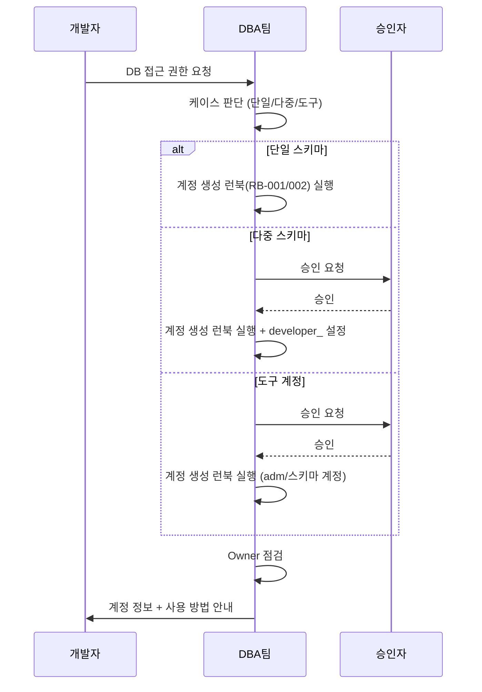

# DB 개발자 계정 요청 대응 런북

| 필드  | 값   |
|-----|-----|
| 도메인 | 데이터베이스 |
| 플랫폼 | `RDBMS` |
| 서비스 | `RDS`, `Oracle`, `PostgreSQL` |
| 유형  | 런북  |
| 대응레벨 | 🟡 단계적 |
| 트리거유형 | 서비스요청 |
| 상태  | 초안  |
| 소유자 | @윤형도 |
| 최종수정 | 2026-04-10 |
| 문서ID | RB-DB-003 |
| 트리거 | 개발자가 DB 접근 권한 요청 또는 다중 스키마 접근 필요 시 |
| 소요시간 | 15분 |
| 난이도 | 쉬움 |
| 키워드 | `개발자 계정`, `_oper`, `_OPER`, `SET ROLE`, `NOINHERIT`, `INHERIT`, `다중 스키마`, `developer_`, `DA#`, `도구 계정`, `_ops`, `_adm`, `접근 권한`, `DB 접근`, `Owner 혼재` |
| 관련문서 | [[DB 계정 분리 규칙]], [[DB 계정 네이밍 규칙]], [[PostgreSQL Owner 관리 규칙]], [[Oracle DB 계정 생성 런북]], [[PostgreSQL DB 계정 생성 런북]] |

개발자가 DB 접근 권한을 요청했을 때 **어떤 유형의 계정을 생성해야 하는지 판단**하고, 생성된 계정의 **사용 방법을 안내**하는 가이드. 실제 계정 생성 SQL은 [[Oracle DB 계정 생성 런북]] 또는 [[PostgreSQL DB 계정 생성 런북]] 참조. Object Owner 혼재 방지가 핵심 원칙이다.

## 배경

개발자가 DB 오브젝트(테이블, 시퀀스 등)를 생성/변경하려면 DDL 권한이 필요하다. Oracle과 PostgreSQL은 권한 모델이 근본적으로 다르며, 특히 PostgreSQL에서는 Object Owner 개념이 핵심이다. 잘못된 계정으로 DDL을 실행하면 Owner 혼재가 발생하여 이후 ALTER/DROP이 불가능해지는 운영 장애로 이어진다.

```
[Oracle]
  스키마 = User → 스키마 계정으로 직접 접속 (단일)
                → _OPER 계정 + DDL_DML_ROLE (19c, 다중)
                → _OPER 계정 + ON SCHEMA (23ai, 다중)

[PostgreSQL]
  Schema Owner = NOLOGIN Role (object_owner_role)
  → _oper 계정: ALTER USER SET role 자동 (단일 스키마)
  → developer_ 계정: NOINHERIT + 수동 SET ROLE (다중 스키마)
  → _adm 계정: DATABASE+Schema Owner 전용, 스키마 생성/삭제만 (DA#, DB 접근제어)
```

## 역할 정의

| 역할  | 담당팀 | 책임 범위 |
|-----|-----|-------|
| 요청자 | 개발팀 | DB 접근 권한 요청서 작성 (부서/서비스명, DBMS 유형, 접근 대상 스키마 명시) |
| DBA | DBA팀 | 케이스 판단, 계정 생성 런북(RB-DB-001/002) 연계 실행, 사용 방법 안내, Owner 점검 |
| 승인자 | 팀장/보안팀 | 다중 스키마 접근 또는 도구 계정 요청 시 승인 |

## Workflow



## 사전 조건

- [ ] 요청자가 부서/서비스명, DBMS 유형(Oracle/PostgreSQL), 접근 대상 스키마를 명시
- [ ] 대상 스키마가 이미 생성되어 있는가 (미생성 시 [[Oracle DB 계정 생성 런북]] 또는 [[PostgreSQL DB 계정 생성 런북]] 참조)
- [ ] 다중 스키마 접근 또는 도구 계정 요청 시 승인 완료
- [ ] PostgreSQL의 경우 NOLOGIN Role(`object_owner_role`, `dml_role`)이 이미 생성되어 있는가

## 상세 절차

### 케이스 1: 단일 스키마 개발자 (대부분)

> 하나의 스키마만 담당하는 개발자. 가장 일반적인 케이스.

#### Oracle

스키마 계정을 개발자에게 직접 발급. Oracle은 Schema = User이므로 DDL/DML 모두 가능.

```
개발자 A → INSA 스키마 담당
→ INSA 계정 발급 (schema_owner)
→ INSA 계정으로 DDL/DML 실행
```

#### PostgreSQL

`_oper` 계정 발급. DBA가 SET ROLE을 자동 설정하므로 개발자는 접속만 하면 됨. 접속 즉시 `object_owner_role`로 동작하여 Object Owner가 항상 NOLOGIN Role로 통일된다.

> 생성 SQL: [[PostgreSQL DB 계정 생성 런북]] Step 1 참조

---

### 케이스 2: 여러 스키마 접근 개발자

> 하나의 개발자가 여러 서비스(스키마)를 담당하는 경우

#### Oracle 19c (★4안)

`DDL_DML_ROLE`이 Global ANY(PDB 전체)이므로 스키마별로 나눠봐야 의미 없음. **파트(팀) 단위로 1개 `_OPER` 생성**.

> 생성 SQL: [[Oracle DB 계정 생성 런북]] Step 3~4 참조
> 예시: `EAS_OPER` 1개로 SMARTBILL, PATUAH, EAS 3개 스키마 접근. 각 서비스 TS에 QUOTA UNLIMITED 부여.

#### Oracle 23ai (★5안)

`ON SCHEMA`로 스키마 단위 권한 부여 가능. 스키마별 `_OPER` 생성.

> 생성 SQL: [[Oracle DB 계정 생성 런북]] Step 2 참조
> 예시: `INSA_OPER`에 INSA 스키마 ON SCHEMA 권한 부여. 다른 스키마 추가 시 PL/SQL 블록 재실행.

#### PostgreSQL (NOINHERIT + 수동 SET ROLE)

기본 `_oper`는 1개 스키마만 자동 설정. 여러 스키마 접근 시 **`developer_` 계정을 NOINHERIT으로** 별도 생성.

```sql
-- developer_ 계정은 NOINHERIT으로 생성 (다중 스키마 전용)
CREATE USER developer_eas WITH PASSWORD '[패스워드]' NOINHERIT;

GRANT smartbill_object_owner_role TO developer_eas;
GRANT patuah_object_owner_role TO developer_eas;
GRANT eas_object_owner_role TO developer_eas;

GRANT CONNECT ON DATABASE easdb TO developer_eas;
```

> `developer_` 계정은 RB-DB-002에 없는 **다중 스키마 전용 패턴**이므로 여기에만 존재.

**NOINHERIT vs INHERIT 비교표**:

| 속성 | SET ROLE 없이 | SET ROLE 후 | CREATE 시 Owner |
|------|-------------|------------|---------------|
| **INHERIT (기본값)** | DDL/DML 가능 | DDL/DML 가능 | **developer 계정 (Owner 혼재!)** |
| **NOINHERIT (권장)** | 접근 불가 | DDL/DML 가능 | **object_owner_role (정상)** |

**사용 예시**:

```sql
-- developer_eas로 접속 후
SET ROLE smartbill_object_owner_role;  -- smartbill 작업
CREATE TABLE smartbill_sch.new_table (...);  -- owner = smartbill_object_owner_role
RESET ROLE;

SET ROLE eas_object_owner_role;  -- eas 작업
SELECT * FROM eas_sch.주문;
RESET ROLE;
```

**`_oper` vs `developer_` 차이**:

| 구분 | `_oper` 계정 | `developer_` 계정 |
|------|-------------|-------------------|
| SET ROLE | `ALTER USER SET role TO` (자동) | 수동 `SET ROLE` (NOINHERIT) |
| 스키마 수 | 1개 | 여러 개 |
| Object Owner | 항상 `object_owner_role` | SET ROLE한 `object_owner_role` |

---

### 케이스 3: DA#/접근제어 도구 계정

#### Oracle

스키마 계정을 그대로 사용. 여러 스키마 관리 시 각 스키마 계정으로 개별 접속.

#### PostgreSQL

`_adm` 계정 사용. DATABASE Owner + Schema Owner 전용으로, 스키마 생성/삭제만 담당한다. `object_owner_role` 멤버십은 부여하지 않으므로 개별 오브젝트 ALTER/DROP은 불가하며, 필요 시 `DROP SCHEMA CASCADE`로 일괄 삭제한다.

> 생성 SQL: [[PostgreSQL DB 계정 생성 런북]] Step 1 참조
> `_adm`에는 `object_owner_role` 멤버십을 부여하지 않음 (오브젝트 개별 조작 차단). `ALTER USER SET role` 설정도 하지 않음.

**PostgreSQL 계정 역할 요약**:

| 계정 | 역할 | 사용 주체 |
|------|------|----------|
| `{서비스명}_adm` | DATABASE+Schema Owner, 스키마 생성/삭제 전용 | DA#, DB 접근제어 |
| `{서비스명}_oper` | 스키마 단위 DDL (SET ROLE 자동) | 개발자 |
| `{서비스명}_svc` | DML 전용 (기본) | 애플리케이션 |

## 검증 방법

| 확인 항목 | 명령어/방법 | 예상 결과 |
|-------|--------|-------|
| PG 계정 존재 | `SELECT rolname, rolcanlogin, rolinherit FROM pg_roles WHERE rolname = '{계정명}';` | NOINHERIT 계정은 rolinherit=false |
| PG Role 부여 | `SELECT g.rolname FROM pg_auth_members m JOIN pg_roles r ON m.member=r.oid JOIN pg_roles g ON m.roleid=g.oid WHERE r.rolname='{계정명}';` | `object_owner_role` 확인 |
| PG SET ROLE 자동 | `SELECT rolconfig FROM pg_roles WHERE rolname='{계정명}';` | `{role=object_owner_role}` |
| Oracle 계정 존재 | `SELECT username FROM dba_users WHERE username='{계정명}';` | 계정 조회됨 |
| Oracle Role 부여 | `SELECT granted_role FROM dba_role_privs WHERE grantee='{계정명}';` | DDL_DML_ROLE 또는 CONNECT |
| Owner 점검 | [[DB 계정 정책 점검 런북]] SQL 실행 | MISMATCH 0건 |

## 롤백 절차

| 단계 | 작업 | 상세 |
|-----|-----|-----|
| 1 | 권한 회수 (PG) | `REVOKE {스키마명}_object_owner_role FROM {계정명};` |
| 2 | 권한 회수 (Oracle) | `REVOKE DDL_DML_ROLE FROM {계정명};` |
| 3 | 계정 삭제 | `DROP USER {계정명};` (오브젝트 미소유 확인 후) |

## 트러블슈팅

| 증상/에러 | 원인 | 해결 |
|-------|-----|-----|
| PG: `permission denied for schema` | NOINHERIT 계정에서 SET ROLE 안 함 | `SET ROLE {스키마명}_object_owner_role;` 실행 |
| PG: Object Owner가 developer 계정 | INHERIT 계정에서 SET ROLE 없이 DDL 실행 | `ALTER USER {계정명} NOINHERIT;` + Owner 정리. [[DB 계정 정책 점검 런북]] 참조 |
| PG: `must be owner of table` | Owner 혼재 | Owner 변경 후 재시도. [[DB 계정 정책 점검 런북]] 참조 |
| Oracle: `ORA-01950` | 서비스 TS에 QUOTA 미부여 | `ALTER USER {계정명} QUOTA UNLIMITED ON {TS명};` |

## 에스컬레이션 기준

| 상황 | 대응 | 담당 |
|-----|-----|-----|
| 계정 생성이 필요한 경우 (Oracle) | [[Oracle DB 계정 생성 런북]] 절차 수행 | DBA팀 @최종현 |
| 계정 생성이 필요한 경우 (PostgreSQL) | [[PostgreSQL DB 계정 생성 런북]] 절차 수행 | DBA팀 @최종현 |
| Owner 혼재 발견 시 | [[DB 계정 정책 점검 런북]] Owner 점검 SQL 실행 | DBA팀 @최종현 |
| DDL_DML_ROLE 최초 생성 필요 (19c) | DBA팀에 PDB 내 Role 생성 요청 | DBA팀 @최종현 |

## 관련 문서

* > 관련: [[DB 계정 분리 규칙]] — 계정 유형 구분 (서비스/개발자/읽기전용)
* > 관련: [[DB 계정 네이밍 규칙]] — _oper/_ops/_adm/developer_ 이름 규칙
* > 관련: [[PostgreSQL Owner 관리 규칙]] — NOINHERIT, SET ROLE, Owner 혼재 방지 기준
* > 관련: [[Oracle DB 계정 생성 런북]] — Oracle 계정 생성 절차 (개발자 계정 포함)
* > 관련: [[PostgreSQL DB 계정 생성 런북]] — PostgreSQL 계정 생성 절차 (개발자 계정 포함)

---

## 요청 예시 템플릿

### 단일 스키마 개발자

```
[요청 정보]
- 부서/서비스: {부서명}
- DBMS 유형: Oracle / PostgreSQL
- 접근 대상 스키마: {스키마명}
```

### 여러 스키마 접근 개발자

```
[요청 정보]
- 부서/서비스: EAS 서비스
- DBMS 유형: PostgreSQL
- 접근 대상 스키마: smartbill_sch, patuah_sch, eas_sch

[PostgreSQL]
- 개발자 계정명: developer_eas (NOINHERIT)
- 권한 상속 대상: smartbill_object_owner_role, patuah_object_owner_role, eas_object_owner_role
```

### 기존 환경 마이그레이션 (Oracle 19c)

```
[요청 정보]
- DBMS 유형: Oracle 19c (레거시)
- 현재 상황: 스키마 계정 3개(INSA, ASSET, CRM)를 앱+개발자가 동일 계정 사용 중
- 조치 요청: 개발자 계정 신규 생성

[Oracle]
- 기존 계정 유지: INSA, ASSET, CRM (서비스 계정)
- 신규 생성: DIST_OPER (DDL_DML_ROLE 부여)
```

---

## 변경 이력

| 버전 | 일자 | 작성자 | 변경내용 |
|-----|-----|-----|------|
| v1.4 | 2026-04-14 | AI(claude-code) | 문서명 변경: DB 개발자 계정 운영 런북 → DB 개발자 계정 요청 대응 런북. 관련 문서에 RB-DB-001/002 참조 추가 |
| v1.3 | 2026-04-14 | AI(claude-code) | 역할 명확화 — 요약문/역할 정의/Workflow를 "케이스 판단 + 안내" 역할로 수정. 계정 생성은 RB-DB-001/002 연계 |
| v1.2 | 2026-04-13 | AI(claude-code) | 키워드 추가: _OPER/INHERIT/Owner 혼재 |
| v1.1 | 2026-04-13 | AI(claude-code) | 관련 문서에 [[Oracle DB 계정 생성 런북]], [[PostgreSQL DB 계정 생성 런북]] 참조 추가 |
| v1.0 | 2026-04-10 | AI(claude-code) | 최초 작성 |
