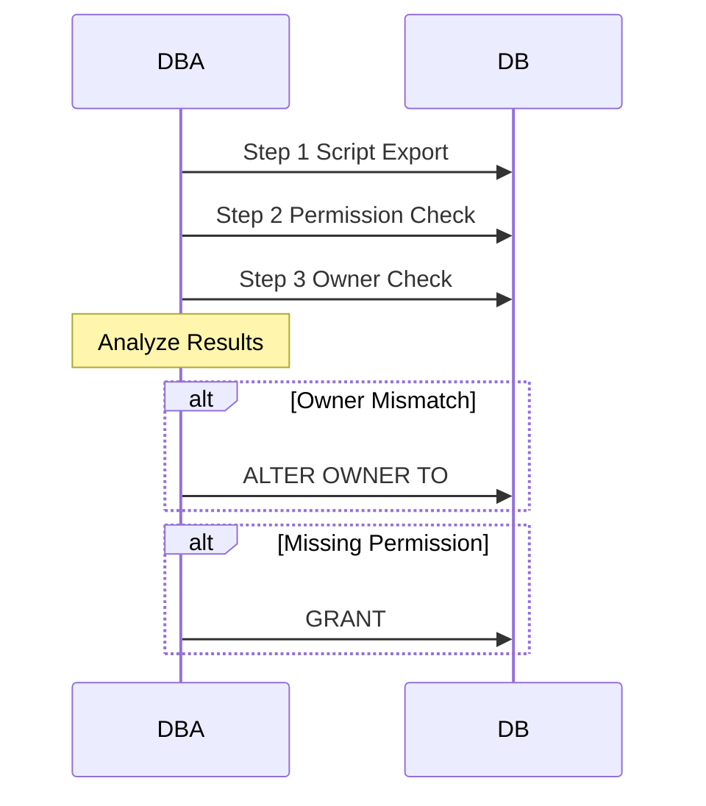

# DB 계정 정책 점검 런북

| 필드 | 값 |
|-----|-----|
| 도메인 | 보안 |
| 플랫폼 | `AWS` |
| 서비스 | `RDS`, `PostgreSQL` |
| 유형 | 런북 |
| 대응레벨 | 🟢 직접처리 |
| 트리거유형 | 정기작업 |
| 상태 | 초안 |
| 소유자 | @윤형도 |
| 최종수정 | 2026-04-10 |
| 문서ID | RB-DB-004 |
| 트리거 | 분기별 정기 점검 또는 계정 생성/변경 후 검증 시 |
| 소요시간 | 15분 |
| 난이도 | 쉬움 |
| 키워드 | `점검`, `policy check`, `Owner 점검`, `권한 미부여`, `스크립트 추출`, `Owner 혼재`, `pg_class`, `pg_roles`, `계정 점검`, `DB 점검`, `정기 점검`, `PostgreSQL`, `마이그레이션`, `권한 추출` |
| 관련문서 | [[DB 계정 분리 규칙]], [[PostgreSQL Owner 관리 규칙]], [[PostgreSQL DB 계정 생성 런북]] |

PostgreSQL DB의 계정/권한/Owner 현황을 점검하는 3가지 SQL 도구 모음. 분기별 정기 점검, 계정 생성/변경 후 검증, Owner 혼재 확인에 사용한다. 정상 상태의 기준은 [[DB 계정 분리 규칙]]과 [[PostgreSQL Owner 관리 규칙]] 참조.

## 배경

계정 생성 후 또는 정기적으로 아래 3가지를 점검해야 한다:

1. **기존 계정의 권한 현황 파악** — 마이그레이션이나 현황 파악 시
2. **권한 누락 확인** — 서비스 계정에 SELECT 등이 빠져있는지
3. **Owner 혼재 확인** — 모든 Object Owner가 `object_owner_role`로 통일되어 있는지

> Owner 혼재가 발생하면 다른 계정이 해당 테이블을 ALTER/DROP 할 수 없게 된다. 자세한 원칙은 [[PostgreSQL Owner 관리 규칙]] 참조.

## 역할 정의

| 역할 | 담당팀 | 책임 범위 |
|-----|-----|-------|
| 점검자 | DBA팀 | SQL 실행 및 결과 분석 |
| 조치자 | DBA팀 | Owner 불일치 수정, 권한 부여 |

## Workflow



## 사전 조건

- [ ] 대상 PostgreSQL Database에 접속 가능한 계정 보유 (rds_superuser 또는 해당 DB의 _adm)
- [ ] 점검 대상 계정명 확인
- [ ] 해당 Database에 `\c {DB명}`으로 접속된 상태

## 상세 절차

### Step 1: 계정 생성 스크립트 추출 (권한 포함)

대상 계정의 현재 설정을 분석하여 **동일 계정을 재생성할 수 있는 DDL**을 자동 추출한다. `target` CTE의 계정명만 변경하면 된다.

**추출 항목**: 일치율 요약 → CREATE USER → Role 멤버십 → 스키마 권한 → 시퀀스 → 함수 → DEFAULT PRIVILEGES → 개별 오브젝트 GRANT

```sql
-- ★ 대상 계정명을 여기만 바꾸면 됩니다
WITH target AS (
    SELECT 'prcs_user'::text AS rname
),
priv_stats AS (
    SELECT
        schemaname,
        priv,
        total_cnt,
        granted_cnt,
        ROUND(granted_cnt * 100.0 / NULLIF(total_cnt, 0), 1) AS match_pct
    FROM (
        SELECT
            t2.schemaname,
            p.priv,
            COUNT(*) AS total_cnt,
            COUNT(*) FILTER (
                WHERE has_table_privilege((SELECT rname FROM target), t2.schemaname || '.' || t2.tablename, p.priv)
            ) AS granted_cnt
        FROM pg_tables t2
        CROSS JOIN (VALUES ('SELECT'),('INSERT'),('UPDATE'),('DELETE')) p(priv)
        WHERE t2.schemaname NOT IN ('pg_catalog', 'information_schema')
        GROUP BY t2.schemaname, p.priv
    ) x
)

-- 0) 일치율 요약
SELECT 0 AS seq,
    '-- [' || schemaname || '] ' || priv || ': ' ||
    granted_cnt || '/' || total_cnt || ' (' || match_pct || '%)' AS ddl
FROM priv_stats
WHERE granted_cnt > 0

UNION ALL

-- 1) CREATE USER
SELECT 1,
    'CREATE USER ' || r.rolname ||
    CASE WHEN r.rolsuper THEN ' SUPERUSER' ELSE '' END ||
    CASE WHEN r.rolcreatedb THEN ' CREATEDB' ELSE '' END ||
    CASE WHEN r.rolcreaterole THEN ' CREATEROLE' ELSE '' END ||
    CASE WHEN r.rolinherit THEN '' ELSE ' NOINHERIT' END ||
    CASE WHEN r.rolreplication THEN ' REPLICATION' ELSE '' END ||
    CASE WHEN r.rolbypassrls THEN ' BYPASSRLS' ELSE '' END ||
    CASE WHEN r.rolconnlimit >= 0 THEN ' CONNECTION LIMIT ' || r.rolconnlimit ELSE '' END ||
    CASE WHEN r.rolvaliduntil IS NOT NULL THEN ' VALID UNTIL ''' || r.rolvaliduntil || '''' ELSE '' END ||
    ' PASSWORD ''변경필요'';'
FROM pg_roles r, target t
WHERE r.rolname = t.rname

UNION ALL

-- 2) GRANT 롤 멤버십
SELECT 2,
    'GRANT ' || g.rolname || ' TO ' || t.rname ||
    CASE WHEN m.admin_option THEN ' WITH ADMIN OPTION' ELSE '' END || ';'
FROM target t
JOIN pg_roles r ON r.rolname = t.rname
JOIN pg_auth_members m ON m.member = r.oid
JOIN pg_roles g ON m.roleid = g.oid

UNION ALL

-- 3) 스키마 권한
SELECT 3,
    'GRANT ' || s.priv || ' ON SCHEMA ' || s.nspname || ' TO ' || t.rname || ';'
FROM target t
CROSS JOIN LATERAL (
    SELECT n.nspname, 'USAGE' AS priv
    FROM pg_namespace n
    WHERE has_schema_privilege(t.rname, n.oid, 'USAGE')
      AND n.nspname NOT IN ('pg_catalog', 'information_schema', 'pg_toast')
    UNION ALL
    SELECT n.nspname, 'CREATE'
    FROM pg_namespace n
    WHERE has_schema_privilege(t.rname, n.oid, 'CREATE')
      AND n.nspname NOT IN ('pg_catalog', 'information_schema', 'pg_toast')
) s

UNION ALL

-- 4) 주석 가이드
SELECT 4,
    '-- [PG14+] DB 전체 읽기 권한 부여 시: GRANT pg_read_all_data TO ' || t.rname || ';'
FROM target t

UNION ALL

SELECT 4,
    '-- [전체 부여 시] GRANT SELECT ON ALL TABLES IN SCHEMA public TO ' || t.rname || ';'
FROM target t

UNION ALL

SELECT 4,
    '-- [신규 테이블 자동 부여 시] ALTER DEFAULT PRIVILEGES IN SCHEMA public GRANT SELECT ON TABLES TO ' || t.rname || ';'
FROM target t

UNION ALL

-- 5) 시퀀스 권한
SELECT 5,
    'GRANT ' || g.privilege_type || ' ON SEQUENCE ' || g.object_schema || '.' || g.object_name || ' TO ' || t.rname || ';'
FROM target t
JOIN information_schema.role_usage_grants g ON g.grantee = t.rname AND g.object_type = 'SEQUENCE'

UNION ALL

-- 6) 함수 권한 (PUBLIC 기본 제외)
SELECT 6,
    'GRANT EXECUTE ON FUNCTION ' || n.nspname || '.' || p.proname ||
    '(' || pg_get_function_identity_arguments(p.oid) || ') TO ' || t.rname || ';'
FROM target t
JOIN pg_proc p ON true
JOIN pg_namespace n ON p.pronamespace = n.oid
WHERE n.nspname NOT IN ('pg_catalog', 'information_schema')
  AND has_function_privilege(t.rname, p.oid, 'EXECUTE')
  AND NOT has_function_privilege('public', p.oid, 'EXECUTE')

UNION ALL

-- 7) DEFAULT PRIVILEGES (기존 설정)
SELECT 7,
    'ALTER DEFAULT PRIVILEGES FOR ROLE ' || pg_get_userbyid(d.defaclrole) ||
    CASE WHEN n.nspname IS NOT NULL THEN ' IN SCHEMA ' || n.nspname ELSE '' END ||
    ' GRANT ' ||
    CASE
        WHEN acl::text LIKE '%r%' THEN 'SELECT'
        WHEN acl::text LIKE '%a%' THEN 'INSERT'
        WHEN acl::text LIKE '%w%' THEN 'UPDATE'
        WHEN acl::text LIKE '%d%' THEN 'DELETE'
        WHEN acl::text LIKE '%D%' THEN 'TRUNCATE'
        WHEN acl::text LIKE '%x%' THEN 'REFERENCES'
        WHEN acl::text LIKE '%t%' THEN 'TRIGGER'
        ELSE 'ALL'
    END ||
    ' ON ' ||
    CASE d.defaclobjtype
        WHEN 'r' THEN 'TABLES'
        WHEN 'S' THEN 'SEQUENCES'
        WHEN 'f' THEN 'FUNCTIONS'
    END ||
    ' TO ' || t.rname || ';'
FROM target t
JOIN pg_default_acl d ON true
LEFT JOIN pg_namespace n ON d.defaclnamespace = n.oid
CROSS JOIN LATERAL unnest(d.defaclacl) AS acl
WHERE split_part(acl::text, '=', 1) = t.rname

UNION ALL

-- 8) 개별 오브젝트 GRANT (맨 아래)
SELECT 80,
    'GRANT SELECT ON ' || schemaname || '.' || tablename || ' TO ' || t.rname || ';'
FROM target t, pg_tables
WHERE schemaname NOT IN ('pg_catalog', 'information_schema')
  AND has_table_privilege(t.rname, schemaname || '.' || tablename, 'SELECT')

UNION ALL

SELECT 81,
    'GRANT INSERT ON ' || schemaname || '.' || tablename || ' TO ' || t.rname || ';'
FROM target t, pg_tables
WHERE schemaname NOT IN ('pg_catalog', 'information_schema')
  AND has_table_privilege(t.rname, schemaname || '.' || tablename, 'INSERT')

UNION ALL

SELECT 82,
    'GRANT UPDATE ON ' || schemaname || '.' || tablename || ' TO ' || t.rname || ';'
FROM target t, pg_tables
WHERE schemaname NOT IN ('pg_catalog', 'information_schema')
  AND has_table_privilege(t.rname, schemaname || '.' || tablename, 'UPDATE')

UNION ALL

SELECT 83,
    'GRANT DELETE ON ' || schemaname || '.' || tablename || ' TO ' || t.rname || ';'
FROM target t, pg_tables
WHERE schemaname NOT IN ('pg_catalog', 'information_schema')
  AND has_table_privilege(t.rname, schemaname || '.' || tablename, 'DELETE')

ORDER BY seq, ddl;
```

### Step 2: 권한 미부여 테이블 확인

특정 계정에 SELECT 권한이 부여되지 않은 테이블 목록을 추출한다. 계정명을 대상 계정으로 변경하여 사용.

```sql
SELECT
    schemaname,
    tablename,
    tableowner
FROM pg_tables
WHERE schemaname NOT IN ('pg_catalog', 'information_schema')
  AND NOT has_table_privilege('prcs_user', schemaname || '.' || tablename, 'SELECT')
ORDER BY schemaname, tablename;
```

### Step 3: Owner 현황 점검

Database → Schema → Object 3단계 Owner를 한 번에 조회. Owner 혼재 여부를 확인할 때 사용. PostgreSQL 11 ~ 18 버전 호환.

> 실행 전 해당 Database에 접속되어 있는지 확인하세요.

```sql
/* PostgreSQL 11 ~ 18 버전 호환 */
WITH db_info AS (
    SELECT
        d.datname,
        r.rolname AS db_owner
    FROM pg_database d
    JOIN pg_roles r ON d.datdba = r.oid
    WHERE d.datname = current_database()
)
SELECT
    d.datname AS database,
    d.db_owner AS database_owner,
    n.nspname AS schema,
    r_schema.rolname AS schema_owner,
    c.relname AS object_name,
    CASE c.relkind
        WHEN 'r' THEN 'TABLE'
        WHEN 'v' THEN 'VIEW'
        WHEN 'm' THEN 'MATERIALIZED VIEW'
        WHEN 'i' THEN 'INDEX'
        WHEN 'S' THEN 'SEQUENCE'
        WHEN 't' THEN 'TOAST'
        WHEN 'f' THEN 'FOREIGN TABLE'
        WHEN 'p' THEN 'PARTITIONED TABLE'
        WHEN 'c' THEN 'COMPOSITE TYPE'
        WHEN 'I' THEN 'PARTITIONED INDEX'
        ELSE 'UNKNOWN (' || c.relkind || ')'
    END AS object_type,
    r_obj.rolname AS object_owner
FROM pg_class c
JOIN pg_namespace n ON c.relnamespace = n.oid
JOIN pg_roles r_obj ON c.relowner = r_obj.oid
JOIN pg_roles r_schema ON n.nspowner = r_schema.oid
CROSS JOIN db_info d
WHERE n.nspname NOT IN ('pg_catalog', 'information_schema', 'pg_toast')

UNION ALL

SELECT
    d.datname AS database,
    d.db_owner AS database_owner,
    n.nspname AS schema,
    r_schema.rolname AS schema_owner,
    p.proname AS object_name,
    CASE p.prokind
        WHEN 'f' THEN 'FUNCTION'
        WHEN 'p' THEN 'PROCEDURE'
        WHEN 'a' THEN 'AGGREGATE'
        WHEN 'w' THEN 'WINDOW'
        ELSE 'ROUTINE'
    END AS object_type,
    r_obj.rolname AS object_owner
FROM pg_proc p
JOIN pg_namespace n ON p.pronamespace = n.oid
JOIN pg_roles r_obj ON p.proowner = r_obj.oid
JOIN pg_roles r_schema ON n.nspowner = r_schema.oid
CROSS JOIN db_info d
WHERE n.nspname NOT IN ('pg_catalog', 'information_schema', 'pg_toast')

ORDER BY database, schema, object_type, object_name;
```

## 검증 방법

| 확인 항목 | 방법 | 정상 상태 |
|-------|------|---------|
| Step 1 결과 | DDL 스크립트가 출력되는지 | 계정 속성/권한이 빠짐없이 추출됨 |
| Step 2 결과 | 미부여 테이블 목록 확인 | 서비스 계정 스키마 내 미부여 테이블이 0건 |
| Step 3 결과 | object_owner 컬럼 확인 | 모든 Object Owner가 `{서비스명}_object_owner_role`로 통일 |
| Owner 혼재 | schema_owner ≠ object_owner | 같은 스키마 내 Object Owner가 1개 Role로 통일 |

## 롤백 절차

| 단계 | 작업 | 상세 |
|-----|-----|-----|
| 1 | Owner 불일치 수정 | `ALTER TABLE {스키마명}.{테이블명} OWNER TO {서비스명}_object_owner_role;` |
| 2 | 시퀀스 Owner 수정 | `ALTER SEQUENCE {스키마명}.{시퀀스명} OWNER TO {서비스명}_object_owner_role;` |
| 3 | 함수 Owner 수정 | `ALTER FUNCTION {스키마명}.{함수명}() OWNER TO {서비스명}_object_owner_role;` |

> Owner 변경은 현재 Owner 또는 superuser만 실행 가능. `SET ROLE`로 현재 Owner로 전환 후 실행.

## 트러블슈팅

| 증상/에러 | 원인 | 해결 |
|-------|-----|-----|
| Object Owner가 개인 계정(`developer_xxx`)으로 되어있음 | INHERIT 계정이 SET ROLE 없이 DDL 실행 | Owner를 `_object_owner_role`로 변경 후, [[DB 개발자 계정 운영 런북]] 참조하여 NOINHERIT 적용 |
| Object Owner가 `postgres`/`fnfadm`으로 되어있음 | 마스터 계정으로 DDL 실행 | Owner를 `_object_owner_role`로 변경. 마스터 계정은 Instance 레벨 전용 — [[PostgreSQL Owner 관리 규칙]] 참조 |
| Step 1 스크립트가 빈 결과 | 계정명 오타 또는 존재하지 않는 계정 | `SELECT rolname FROM pg_roles WHERE rolname = '{계정명}';`으로 확인 |
| Step 2에서 대량 미부여 발견 | DEFAULT PRIVILEGES 미설정 | [[PostgreSQL DB 계정 생성 런북]]의 DEFAULT PRIVILEGES 설정 참조 |

## 에스컬레이션 기준

| 상황 | 대응 | 담당 |
|-----|-----|-----|
| Owner 혼재가 수백 건 이상 | 일괄 수정 스크립트 작성 필요 | DBA팀 @최종현 |
| database_owner가 postgres/fnfadm | DB Owner 변경 필요 (`ALTER DATABASE ... OWNER TO`) | DBA팀 @최종현 |
| 권한 미부여가 서비스 장애를 유발 | 긴급 GRANT 실행 | DBA팀 @최종현 |

## 관련 문서

* > 관련: [[DB 계정 분리 규칙]] — 정책 기준 (정상 상태 정의)
* > 관련: [[PostgreSQL Owner 관리 규칙]] — Owner 3단 분리 기준
* > 관련: [[PostgreSQL DB 계정 생성 런북]] — Owner 정리 후 재설정 시
* > 관련: [[DB 개발자 계정 운영 런북]] — Owner 혼재 원인 파악 시 (NOINHERIT/SET ROLE)

---

## 변경 이력

| 버전 | 일자 | 작성자 | 변경내용 |
|-----|-----|-----|------|
| v1.2 | 2026-04-13 | AI(claude-code) | 키워드 추가: PostgreSQL/마이그레이션/권한 추출 |
| v1.1 | 2026-04-13 | AI(claude-code) | 메타블록 관련문서에 [[Database Platform Index]] 제거 |
| v1.0 | 2026-04-10 | AI(claude-code) | 최초 작성 |
