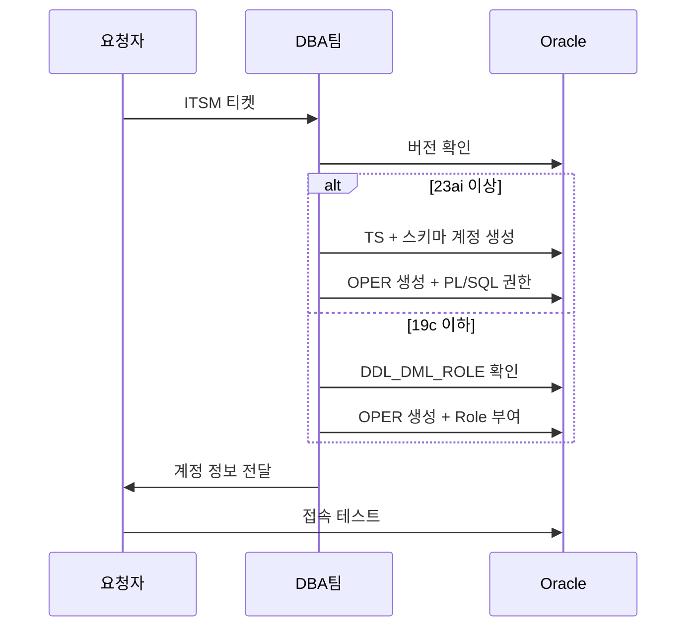

# Oracle DB 계정 생성 런북

| 필드 | 값 |
|-----|-----|
| 도메인 | 인프라 |
| 플랫폼 | `AWS` |
| 서비스 | `RDS`, `Oracle` |
| 유형 | 런북 |
| 대응레벨 | 🔴 에스컬레이션 |
| 트리거유형 | 서비스요청 |
| 상태 | 초안 |
| 소유자 | @윤형도 |
| 최종수정 | 2026-04-10 |
| 문서ID | RB-DB-001 |
| 트리거 | ITSM 서비스 요청 중 "Oracle DB 계정 생성/변경" 요청 |
| 소요시간 | 30분 |
| 난이도 | 보통 |
| 키워드 | `Oracle`, `계정 생성`, `DDL_DML_ROLE`, `_OPER`, `PL/SQL`, `ON SCHEMA`, `19c`, `23ai`, `스키마 계정`, `개발자 계정`, `읽기전용`, `DB 계정`, `테이블스페이스`, `OPER_TS`, `RDS` |
| 관련문서 | [[DB 계정 분리 규칙]], [[DB 계정 네이밍 규칙]], [[DB 개발자 계정 요청 대응 런북]] |

Oracle DB에서 스키마 계정(=서비스 계정), 개발자 계정(`_OPER`), 읽기전용 계정을 생성하는 런북. Oracle은 Schema = User 구조이므로 스키마 계정이 곧 서비스 계정이며 DDL을 자연 보유한다. 버전별로 19c(★4안: DDL_DML_ROLE)와 23ai(★5안: PL/SQL ON SCHEMA) 두 가지 절차를 제공한다. 계정 유형/권한 기준은 [[DB 계정 분리 규칙]], 네이밍은 [[DB 계정 네이밍 규칙]] 참조.

## 배경

### Schema = User 제약

Oracle은 User를 만들면 동명의 Schema가 자동 생성된다. 따라서 서비스 계정에서 DDL을 완전히 분리할 수 없으며, 개발자 계정(`_OPER`)을 별도로 생성하여 **계정 분리 요건만 충족**한다.

### 5가지 안 중 ★4안/★5안 선택 사유

| 안 | 서비스계정 | 개발자계정 | 계정수 | 비고 |
|----|----------|----------|-------|------|
| 1안 | `_SVC` (스키마별) | `_OPER` 1개 (DB 전체) | 5 | 버전별 이중 설계 |
| 2안 | `_SVC` (스키마별) | `_OPER` 스키마별 | 6 | PG 구조 통합 |
| 3안 | `_SVC` (스키마별) | 스키마 계정 직접 접속 | 4 | 소스코드 변경 가능 시 |
| **★4안** | 스키마 계정 유지 | `_OPER` 1개 (DB 전체) | 3 | **19c 적용안** |
| **★5안** | 스키마 계정 유지 | `_OPER` 스키마별 | 4 | **23ai 적용안** |

> **★4안/★5안 선택 사유**: 소스코드에서 `스키마.테이블명` prefix 변경이 어려움 → 기존 스키마 계정을 서비스 계정으로 유지. 앱 설정 변경 불필요.

## 역할 정의

| 역할 | 담당팀 | 책임 범위 |
|-----|-----|-------|
| 요청자 | 서비스팀 | 필요 계정 유형, 서비스명, 스키마명 정의 |
| 처리자 | DBA팀 | 계정/Role/테이블스페이스 생성, 권한 부여 |
| 검증자 | 요청자 | 접속 테스트, DDL/DML 동작 확인 |

## Workflow



## 사전 조건

- [ ] ITSM 티켓 승인 완료
- [ ] Oracle 버전 확인 (19c / 23ai)
- [ ] 서비스명, 스키마명 확정
- [ ] 테이블스페이스 용량 계획 확인
- [ ] 패스워드 정책 준수 확인 (12자리, 영대2+영소2+숫자2+특수2) — [[DB 계정 분리 규칙]] 참조

## 상세 절차

### Step 1: Oracle 23ai+ 스키마 계정 생성 (★5안)

> 스키마 계정이 곧 서비스 계정 — 앱이 이 계정으로 접속하여 DML 수행. Owner이므로 DDL 자연 보유.

```sql
-- 테이블스페이스 생성
CREATE TABLESPACE [스키마명]_TS
  DATAFILE '+DATA' SIZE 1G
  AUTOEXTEND ON MAXSIZE 100G;

-- 스키마 계정 생성 (= 서비스 계정)
CREATE USER [스키마명]
  IDENTIFIED BY "[패스워드]"
  DEFAULT TABLESPACE [스키마명]_TS
  TEMPORARY TABLESPACE TEMP
  ACCOUNT UNLOCK;

-- 기본 권한 부여
GRANT CONNECT TO [스키마명];
GRANT RESOURCE TO [스키마명];

-- 테이블스페이스 QUOTA 부여
ALTER USER [스키마명] QUOTA UNLIMITED ON [스키마명]_TS;
```

### Step 2: Oracle 23ai+ 개발자 계정 생성 + PL/SQL DDL 일괄 부여 (★5안)

> 변수 2개(`v_schema`, `v_grantee`)만 변경하면 27개 권한 일괄 부여. OPER_TS 불필요 (ON SCHEMA로 본인 스키마에 권한 없음).

```sql
-- 개발자 계정 생성
CREATE USER [스키마명]_OPER
  IDENTIFIED BY "[패스워드]"
  DEFAULT TABLESPACE [스키마명]_TS
  TEMPORARY TABLESPACE TEMP
  ACCOUNT UNLOCK;

GRANT CONNECT TO [스키마명]_OPER;
ALTER USER [스키마명]_OPER QUOTA UNLIMITED ON [스키마명]_TS;
ALTER USER [스키마명]_OPER QUOTA UNLIMITED ON [스키마명]_IDX;  -- 인덱스 TS (있는 경우)

-- DDL+DML 일괄 부여 (ON SCHEMA 방식, Oracle 23ai+)
DECLARE
    v_schema  VARCHAR2(30) := '[스키마명]';
    v_grantee VARCHAR2(30) := '[스키마명]_OPER';
    TYPE t_privs IS TABLE OF VARCHAR2(50);
    v_privs t_privs := t_privs(
        'SELECT ANY TABLE','INSERT ANY TABLE','UPDATE ANY TABLE','DELETE ANY TABLE',
        'CREATE ANY TABLE','ALTER ANY TABLE','DROP ANY TABLE','COMMENT ANY TABLE',
        'CREATE ANY INDEX','ALTER ANY INDEX','DROP ANY INDEX',
        'SELECT ANY SEQUENCE','CREATE ANY SEQUENCE','ALTER ANY SEQUENCE','DROP ANY SEQUENCE',
        'CREATE ANY VIEW','DROP ANY VIEW',
        'CREATE ANY PROCEDURE','ALTER ANY PROCEDURE','DROP ANY PROCEDURE',
        'EXECUTE ANY PROCEDURE','DEBUG ANY PROCEDURE',
        'CREATE ANY TRIGGER','DROP ANY TRIGGER',
        'CREATE ANY TYPE','DROP ANY TYPE',
        'GRANT ANY OBJECT PRIVILEGE'
    );
BEGIN
    FOR i IN 1..v_privs.COUNT LOOP
        EXECUTE IMMEDIATE 'GRANT ' || v_privs(i) || ' ON SCHEMA ' || v_schema || ' TO ' || v_grantee;
    END LOOP;
    EXECUTE IMMEDIATE 'GRANT DEBUG CONNECT SESSION TO ' || v_grantee;
END;
/
```

### Step 3: Oracle 19c DDL_DML_ROLE 생성 (★4안, PDB 내 최초 1회)

> 이미 생성되어 있으면 건너뜀. 버전 업그레이드로 새 DDL 추가 시 Role에만 추가 → 모든 `_OPER`가 자동 상속.

```sql
CREATE ROLE DDL_DML_ROLE;

-- DML
GRANT SELECT ANY TABLE TO DDL_DML_ROLE;
GRANT INSERT ANY TABLE TO DDL_DML_ROLE;
GRANT UPDATE ANY TABLE TO DDL_DML_ROLE;
GRANT DELETE ANY TABLE TO DDL_DML_ROLE;

-- DDL: Table
GRANT CREATE ANY TABLE TO DDL_DML_ROLE;
GRANT ALTER ANY TABLE TO DDL_DML_ROLE;
GRANT DROP ANY TABLE TO DDL_DML_ROLE;
GRANT COMMENT ANY TABLE TO DDL_DML_ROLE;

-- DDL: Index
GRANT CREATE ANY INDEX TO DDL_DML_ROLE;
GRANT ALTER ANY INDEX TO DDL_DML_ROLE;
GRANT DROP ANY INDEX TO DDL_DML_ROLE;

-- DDL: Sequence
GRANT SELECT ANY SEQUENCE TO DDL_DML_ROLE;
GRANT CREATE ANY SEQUENCE TO DDL_DML_ROLE;
GRANT ALTER ANY SEQUENCE TO DDL_DML_ROLE;
GRANT DROP ANY SEQUENCE TO DDL_DML_ROLE;

-- DDL: View
GRANT CREATE ANY VIEW TO DDL_DML_ROLE;
GRANT DROP ANY VIEW TO DDL_DML_ROLE;

-- DDL: Procedure
GRANT CREATE ANY PROCEDURE TO DDL_DML_ROLE;
GRANT ALTER ANY PROCEDURE TO DDL_DML_ROLE;
GRANT DROP ANY PROCEDURE TO DDL_DML_ROLE;
GRANT EXECUTE ANY PROCEDURE TO DDL_DML_ROLE;
GRANT DEBUG ANY PROCEDURE TO DDL_DML_ROLE;

-- DDL: Trigger
GRANT CREATE ANY TRIGGER TO DDL_DML_ROLE;
GRANT DROP ANY TRIGGER TO DDL_DML_ROLE;

-- DDL: Type
GRANT CREATE ANY TYPE TO DDL_DML_ROLE;
GRANT DROP ANY TYPE TO DDL_DML_ROLE;

-- 기타
GRANT GRANT ANY OBJECT PRIVILEGE TO DDL_DML_ROLE;
GRANT DEBUG CONNECT SESSION TO DDL_DML_ROLE;
```

### Step 4: Oracle 19c 개발자 계정 생성 (★4안)

> `OPER_TS` (1MB)로 본인 스키마 오브젝트 생성 물리적 차단. 서비스 TS에만 QUOTA 부여.

```sql
CREATE TABLESPACE OPER_TS DATAFILE SIZE 1M AUTOEXTEND OFF;  -- PDB 내 최초 1회

CREATE USER [서비스명]_OPER
  IDENTIFIED BY "[패스워드]"
  DEFAULT TABLESPACE OPER_TS
  TEMPORARY TABLESPACE TEMP
  ACCOUNT UNLOCK;

GRANT CONNECT TO [서비스명]_OPER;
GRANT DDL_DML_ROLE TO [서비스명]_OPER;  -- 이 1줄이면 끝

ALTER USER [서비스명]_OPER QUOTA UNLIMITED ON [서비스명]_TS;
ALTER USER [서비스명]_OPER QUOTA UNLIMITED ON [서비스명]_IDX;  -- 인덱스 TS (있는 경우)
```

### Step 5: 읽기전용 계정 생성

```sql
CREATE USER [읽기전용계정명]
  IDENTIFIED BY "[패스워드]"
  DEFAULT TABLESPACE USERS
  TEMPORARY TABLESPACE TEMP
  ACCOUNT UNLOCK;

GRANT CONNECT TO [읽기전용계정명];

-- Database 전체 읽기 (서비스 데이터)
GRANT SELECT ANY TABLE TO [읽기전용계정명];

-- Database 전체 읽기 (시스템 딕셔너리)
GRANT SELECT ANY DICTIONARY TO [읽기전용계정명];

-- 특정 스키마만 읽기 (Oracle 23ai 이상)
-- GRANT SELECT ANY TABLE ON SCHEMA [스키마명] TO [읽기전용계정명];
```

## 검증 방법

| 확인 항목 | 명령어 | 예상 결과 |
|-------|--------|-------|
| 계정 존재 | `SELECT username FROM dba_users WHERE username='[계정명]';` | 계정 조회됨 |
| Role 부여 (19c) | `SELECT granted_role FROM dba_role_privs WHERE grantee='[계정명]';` | DDL_DML_ROLE 확인 |
| ON SCHEMA (23ai) | `SELECT * FROM dba_schema_privs WHERE grantee='[계정명]';` | 27개 권한 확인 |
| QUOTA 확인 | `SELECT tablespace_name, max_bytes FROM dba_ts_quotas WHERE username='[계정명]';` | 서비스 TS에 UNLIMITED |
| 접속 테스트 | 요청자가 해당 계정으로 접속 | 정상 접속 |

## 롤백 절차

| 단계 | 작업 | 상세 |
|-----|-----|-----|
| 1 | 개발자 계정 삭제 | `DROP USER [계정명];` (오브젝트 미생성 확인 후) |
| 2 | Role 회수 (19c) | `REVOKE DDL_DML_ROLE FROM [계정명];` |
| 3 | 스키마 계정 삭제 (필요 시) | `DROP USER [스키마명] CASCADE;` (데이터 유실 주의) |

## 트러블슈팅

| 증상/에러 | 원인 | 해결 |
|-------|-----|-----|
| `ORA-01950: no privileges on tablespace` | 서비스 TS에 QUOTA 미부여 | `ALTER USER [계정명] QUOTA UNLIMITED ON [TS명];` |
| `ORA-01031: insufficient privileges` | DDL_DML_ROLE 미부여 또는 ON SCHEMA 미설정 | Role/PL/SQL 부여 확인 후 재실행 |
| 23ai PL/SQL 실행 오류 | `v_schema`/`v_grantee` 변수 오타 | 변수값 확인 후 재실행 |
| 19c에서 본인 스키마에 오브젝트 생성됨 | OPER_TS가 아닌 서비스 TS가 DEFAULT | DEFAULT TABLESPACE가 OPER_TS인지 확인 |

## 에스컬레이션 기준

| 상황 | 대응 | 담당 |
|-----|-----|-----|
| 글로벌 DDL_DML_ROLE 수정 필요 | Role에 권한 추가 (전체 _OPER에 자동 상속) | DBA팀 @최종현 |
| 테이블스페이스 용량 부족 | TS 확장 또는 신규 TS 생성 | DBA팀 @최종현 |
| 스키마 계정의 DDL 분리 요청 (19c) | 19c에서는 불가. 23ai 업그레이드 안내 | DBA팀 @최종현 |

## 관련 문서

* > 관련: [[DB 계정 분리 규칙]] — 계정 유형/권한 기준, 패스워드 정책
* > 관련: [[DB 계정 네이밍 규칙]] — Oracle 대문자 네이밍, _OPER, DDL_DML_ROLE, OPER_TS
* > 관련: [[DB 개발자 계정 요청 대응 런북]] — 생성 전 케이스 판단(단일/다중/도구) + 생성 후 사용법 안내
* > 관련: [[DB 계정 정책 점검 런북]] — 생성 후 점검

---

## 변경 이력

| 버전 | 일자 | 작성자 | 변경내용 |
|-----|-----|-----|------|
| v1.2 | 2026-04-13 | AI(claude-code) | 키워드 추가: RDS |
| v1.1 | 2026-04-13 | AI(claude-code) | 메타블록 관련문서에 [[Database Platform Index]] 제거 |
| v1.0 | 2026-04-10 | AI(claude-code) | 최초 작성 |
