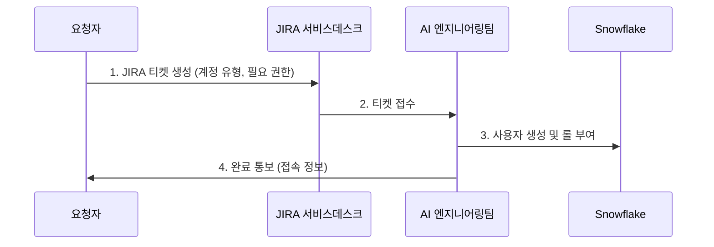

# Snowflake 사용자 계정 관리 런북

| 필드  | 값   |
|-----|-----|
| 도메인 | 데이터 |
| 플랫폼 | `Snowflake` |
| 서비스 | `IAM`, `RBAC` |
| 유형  | 런북  |
| 대응레벨 | 🟢 직접처리 |
| 트리거유형 | 서비스요청 |
| 상태  | 초안  |
| 소유자 | @김가람휘 |
| 최종수정 | 2026-04-10 |
| 문서ID | RB-SF-001 |
| 트리거 | JIRA "Snowflake 계정 생성/삭제" 요청 |
| 소요시간 | 10분 |
| 난이도 | 쉬움  |
| 키워드 | `Snowflake 사용자`, `계정 생성`, `계정 삭제`, `계정 신청`, `롤 부여`, `권한 부여`, `사용자 추가`, `사용자 삭제`, `Snowflake 접근`, `Snowflake 로그인`, `SSO`, `PAT`, `RSA`, `Snowsight`, `DBeaver`, `DataGrip` |
| 관련문서 | \[\[Snowflake Platform Index\]\], \[\[Snowflake RBAC 표준\]\], \[\[Snowflake 네이밍 규칙\]\], \[\[Snowflake Account Inventory\]\] |

Snowflake 사용자 계정 관리(계정 신청, 접속 방법, 인증 방식별 연결) 런북. JIRA 서비스데스크를 통한 계정 신청, Microsoft SSO·PAT·RSA 인증 방식별 접속 절차를 포함한다. ID/PW 로그인은 미지원이며, 2026년 상반기 내 기존 ID/PW 계정도 SSO로 전환 예정이다.

## 필독사항


1. Snowflake에서 **ID/PW 로그인을 지원하지 않을 계획**으로 신규 사용자는 **Microsoft SSO 방식으로만 계정 발급** 가능합니다.
   * 기존 ID/PW 기반 계정도 **2026년 상반기 내 MS SSO 방식으로 전환 예정**입니다.
2. 계정 및 권한 요청은 **JIRA를 통해 신청**합니다.
   * https://fnf.atlassian.net/servicedesk/customer/portal/50/group/158/create/1189
3. 사용 목적에 따라 인증 방식이 다릅니다.
   * **SSO**: 일반 사용자 접속
   * **PAT**: 로컬 개발 자동화
   * **RSA**: 서비스 / 배치 시스템
4. 개인키(.p8), PAT 토큰 등 **인증 정보는 외부 공유 및 Git 저장소 업로드를 금지**합니다.

## 접속 정보 요약

> 상세 접속 정보는 \[\[Snowflake Account Inventory\]\] 참조

| 항목  | 값   |
|-----|-----|
| Snowsight (웹) | https://app.snowflake.com/cixxjbf/wp67697 |
| Host | `gv28284.ap-northeast-2.aws.snowflakecomputing.com` |
| Port | 443 |
| Database | `FNF` |
| Warehouse | `DEV_WH` (기본) |
| Account (Locator) | `gv28284.ap-northeast-2.aws` |
| Account (Connector) | `cixxjbf-wp67697` |

## 1. Snowflake 계정 신청 방법

### 계정 신청 (User / Service)

**신청 경로**: JIRA 서비스데스크 **신청 URL**: https://fnf.atlassian.net/servicedesk/customer/portal/50/group/158/create/1189 **담당자**: AI 엔지니어링팀 김가람휘

| 계정 유형 | 인증 방식 | 용도  | 신청 시 필요 정보 |
|-------|-------|-----|------------|
| **User** | Microsoft SSO | 일반 접속, 분석, 개발 | 이름, 이메일(@fnf.co.kr), 접근할 DB/스키마, 필요 롤 |
| **Service** | RSA 키페어 | 서비스/배치 시스템 연동 | 서비스명, 용도, 접근할 DB/스키마, 담당팀 |

### Workflow



### 관리자 처리 절차

**User 계정 생성 (SSO)**:

```sql
USE ROLE SECURITYADMIN;

CREATE USER GARAMHWI_KIM
  LOGIN_NAME = 'garamhwi.kim@fnf.co.kr'
  DISPLAY_NAME = '김가람휘'
  EMAIL = 'garamhwi.kim@fnf.co.kr'
  DEFAULT_ROLE = 'FR_ANALYST'
  DEFAULT_WAREHOUSE = 'DEV_WH'
  MUST_CHANGE_PASSWORD = FALSE;

GRANT ROLE FR_ANALYST TO USER GARAMHWI_KIM;
```

**Service 계정 생성 (RSA)**:

```sql
USE ROLE SECURITYADMIN;

CREATE USER SVC_ETL_PIPELINE
  LOGIN_NAME = 'SVC_ETL_PIPELINE'
  DISPLAY_NAME = 'ETL Pipeline Service'
  DEFAULT_ROLE = 'FR_ETL_EXECUTOR'
  DEFAULT_WAREHOUSE = 'PROD_ETL_WH'
  TYPE = 'SERVICE'
  MUST_CHANGE_PASSWORD = FALSE;

GRANT ROLE FR_ETL_EXECUTOR TO USER SVC_ETL_PIPELINE;

-- RSA 공개키 등록
ALTER USER SVC_ETL_PIPELINE SET RSA_PUBLIC_KEY = '<공개키>';
```

## 2. Snowflake 접속 방법

### 1️⃣ Snowflake 웹사이트 (Snowsight) 접속


1. https://app.snowflake.com/cixxjbf/wp67697 접속
2. **Sign in using** → **Microsoft** 선택
3. 회사 Microsoft 계정으로 SSO 로그인

### 2️⃣ DBeaver, DataGrip, PyCharm (데이터베이스 툴) 연결

도구별 연결 시 공통 설정:

| 항목  | 값   |
|-----|-----|
| Host | `gv28284.ap-northeast-2.aws.snowflakecomputing.com` |
| Port | `443` |
| Account | `gv28284.ap-northeast-2.aws` |
| Database | `FNF` |
| Warehouse | `DEV_WH` |
| Authenticator | `externalbrowser` (SSO 방식) |
| Role | 부여받은 롤 |

### 3️⃣ User 계정 로컬 코드 연결

#### 로컬 연결 방식 3가지 비교

| 구분  | RSA 키 방식 (서비스 계정) | PAT 토큰 방식 | External Browser (SSO) |
|-----|-------------------|-----------|------------------------|
| 사용 대상 | **Service**       | **User**  | **User**               |
| 쉽게 말하면 | 개인 열쇠 파일로 로그인     | 비밀번호 대신 사용하는 인증 토큰 | 회사 로그인 창으로 들어감         |
| 로그인할 때 | 자동 로그인 가능         | 자동 로그인 가능 | 매번 브라우저 로그인            |
| 자동 작업 | ✅ 가능              | ✅ 가능      | ❌ 어려움                  |
| 보안 수준 | ⭐⭐⭐⭐ 키 관리 잘하면 안전  | ⭐⭐⭐ 토큰 유출 시 위험 | ⭐⭐⭐⭐⭐ 가장 안전            |
| 관리 편의성 | 키 관리 필요           | 코드 관리 필요  | 매우 쉬움                  |
| 추천 용도 | 자동화/배치 작업         | 간단한 연동, 테스트용 | 사람이 직접 접속할 때           |
| 네트워크 정책 | ⚠️ 환경에 따라 정책 적용 가능 (외부 사용 가능) | ⚠️ **사내만 사용 가능, VPN 불가** | ❌ 필요하지 않음              |

**상황별 추천 방식**:

| 상황  | 추천 방식 |
|-----|-------|
| 사람이 직접 SQL 실행, 단발성 개발 | SSO   |
| 로컬 개발 자동화 | PAT   |
| 서비스 / 배치 시스템 | RSA   |

#### 1. SSO 방식 (External Browser)

```python
import snowflake.connector

conn = snowflake.connector.connect(
    account='cixxjbf-wp67697',
    user='<your_email>@fnf.co.kr',
    authenticator='externalbrowser',
    warehouse='DEV_WH',
    database='FNF',
    role='<your_role>'
)
```

> 실행 시 브라우저가 열리고 Microsoft 로그인을 진행합니다.

#### 2. PAT 토큰 방식

```python
import snowflake.connector

conn = snowflake.connector.connect(
    account='cixxjbf-wp67697',
    user='<your_email>@fnf.co.kr',
    authenticator='snowflake_jwt',
    token='<PAT_TOKEN>',
    warehouse='DEV_WH',
    database='FNF',
    role='<your_role>'
)
```

> ⚠️ PAT 토큰은 **사내 네트워크에서만 사용 가능** (VPN 불가). 토큰은 Snowsight에서 발급합니다.

### 4️⃣ Service 계정 연결 방법 (RSA 방식)

```python
import snowflake.connector
from cryptography.hazmat.primitives import serialization
from cryptography.hazmat.backends import default_backend

# 개인키 로드
with open('/path/to/rsa_key.p8', 'rb') as key_file:
    private_key = serialization.load_pem_private_key(
        key_file.read(),
        password=None,
        backend=default_backend()
    )

private_key_bytes = private_key.private_bytes(
    encoding=serialization.Encoding.DER,
    format=serialization.PrivateFormat.PKCS8,
    encryption_algorithm=serialization.NoEncryption()
)

conn = snowflake.connector.connect(
    account='cixxjbf-wp67697',
    user='SVC_ETL_PIPELINE',
    private_key=private_key_bytes,
    warehouse='PROD_ETL_WH',
    database='FNF',
    role='FR_ETL_EXECUTOR'
)
```

> ⚠️ 개인키(.p8) 파일은 **외부 공유 및 Git 저장소 업로드를 금지**합니다.

## 사용자 비활성화/삭제

```sql
-- 비활성화 (퇴사/이동 시 우선 비활성화)
ALTER USER GARAMHWI_KIM SET DISABLED = TRUE;

-- 30일 후 삭제 (확인 완료 후)
DROP USER GARAMHWI_KIM;
```

## 롤 변경

```sql
-- 기존 롤 회수
REVOKE ROLE FR_VIEWER FROM USER GARAMHWI_KIM;

-- 새 롤 부여
GRANT ROLE FR_ANALYST TO USER GARAMHWI_KIM;

-- 기본 롤 변경
ALTER USER GARAMHWI_KIM SET DEFAULT_ROLE = 'FR_ANALYST';
```

## 검증 방법

```sql
-- 사용자 정보 확인
SHOW USERS LIKE 'GARAMHWI_KIM';

-- 부여된 롤 확인
SHOW GRANTS TO USER GARAMHWI_KIM;
```

| 확인 항목 | 예상 결과 | 확인 방법 |
|-------|-------|-------|
| 사용자 존재 | SHOW USERS에 표시 | `SHOW USERS` |
| 롤 부여  | 올바른 기능 롤 확인 | `SHOW GRANTS TO USER` |
| SSO 로그인 | Microsoft 로그인 성공 | 사용자 직접 확인 |

## 트러블슈팅

| 증상  | 원인  | 해결 방법 |
|-----|-----|-------|
| SSO 로그인 실패 | LOGIN_NAME과 Microsoft 이메일 불일치 | LOGIN_NAME을 이메일과 일치시킴 |
| PAT 토큰으로 접속 안됨 | 사내 네트워크 외부에서 접속 시도 | 사내 네트워크에서 재시도 (VPN 불가) |
| 기본 롤로 전환 안됨 | DEFAULT_ROLE이 부여되지 않은 롤 | `GRANT ROLE` 후 `ALTER USER SET DEFAULT_ROLE` |
| 웨어하우스 사용 불가 | 롤에 WH USAGE 권한 없음 | 기능 롤에 WH 권한 포함 확인 |
| RSA 키 인증 실패 | 공개키 미등록 또는 키 형식 불일치 | `ALTER USER SET RSA_PUBLIC_KEY` 재설정 |

## 에스컬레이션 기준

| 상황  | 조치  | 에스컬레이션 대상 |
|-----|-----|-----------|
| ACCOUNTADMIN 권한 요청 | 업무 적합성 검토 필수 | AI 엔지니어링팀 + 보안팀 |
| 대량 사용자 일괄 생성 (10명+) | 스크립트 작성 및 검토 | AI 엔지니어링팀 |
| 서비스 계정 키 유출 의심 | 키 즉시 교체, 감사 로그 확인 | AI 엔지니어링팀 + 보안팀 |
| PAT 토큰 유출 의심 | 토큰 즉시 폐기, 재발급 | AI 엔지니어링팀 |

> 🟢 **직접처리**: 일반적인 사용자 생성/삭제/롤 변경은 담당자가 직접 처리합니다.

## 변경 이력

| 버전  | 일자  | 작성자 | 변경내용 |
|-----|-----|-----|------|
| v1.2 | 2026-04-10 | AI(claude-code) | 실제 접속 정보 반영 (Account Locator, Connector account, Snowsight URL, Host, DB, WH) |
| v1.1 | 2026-04-10 | AI(claude-code) | Notion Snowflake 가이드 기반 전면 개편 — SSO/PAT/RSA 인증 방식, JIRA 신청, 접속 방법 가이드 반영 |
| v1.0 | 2026-04-10 | AI(claude-code) | 최초 작성 |