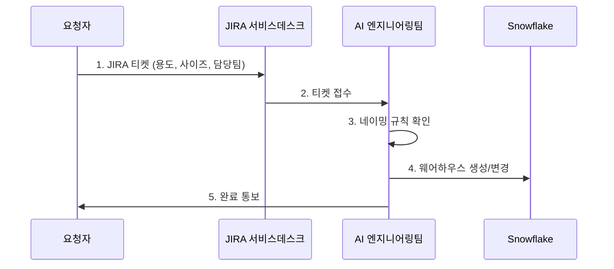

# Snowflake 웨어하우스 관리 런북

| 필드  | 값   |
|-----|-----|
| 도메인 | 데이터 |
| 플랫폼 | `Snowflake` |
| 서비스 | `Warehouse` |
| 유형  | 런북  |
| 대응레벨 | 🟡 단계적 |
| 트리거유형 | 변경요청 |
| 상태  | 초안  |
| 소유자 | @김가람휘 |
| 최종수정 | 2026-04-10 |
| 문서ID | RB-SF-002 |
| 트리거 | JIRA "웨어하우스 생성/변경" 요청, 성능 이슈로 인한 사이즈 조정 |
| 소요시간 | 10분 |
| 난이도 | 보통  |
| 키워드 | `웨어하우스 생성`, `웨어하우스 변경`, `WH 생성`, `WH 사이즈`, `스케일업`, `스케일다운`, `오토서스펜드`, `Auto-Suspend`, `리사이즈`, `Warehouse` |
| 관련문서 | \[\[Snowflake Platform Index\]\], \[\[Snowflake Warehouse Inventory\]\], \[\[Snowflake 네이밍 규칙\]\] |

Snowflake 웨어하우스 관리(WH 생성, 사이즈 변경, 삭제) 런북. 웨어하우스 생성, 스케일업/스케일다운, 오토서스펜드 설정 변경 절차를 포함한다. 사이즈 변경은 즉시 적용되며 다운타임 없음.

## Workflow



## 사전 조건

- [ ] JIRA 티켓 승인 완료
- [ ] SYSADMIN 이상 롤 보유
- [ ] 네이밍 규칙 확인 (\[\[Snowflake 네이밍 규칙\]\])
- [ ] 비용 영향 확인 (\[\[Snowflake Warehouse Inventory\]\] 크레딧 표 참조)

## 상세 절차

### Case 1: 웨어하우스 생성

```sql
USE ROLE SYSADMIN;

CREATE WAREHOUSE PROD_ANALYTICS_WH
  WAREHOUSE_SIZE = 'MEDIUM'
  AUTO_SUSPEND = 300            -- 5분
  AUTO_RESUME = TRUE
  MIN_CLUSTER_COUNT = 1
  MAX_CLUSTER_COUNT = 1         -- 멀티클러스터 비활성화
  INITIALLY_SUSPENDED = TRUE    -- 생성 시 서스펜드 상태
  COMMENT = 'BI/분석 쿼리용 - 데이터분석팀';

-- 사용 권한 부여 (해당 기능 롤에)
GRANT USAGE ON WAREHOUSE PROD_ANALYTICS_WH TO ROLE FR_ANALYST;
```

### Case 2: 사이즈 변경 (스케일업/스케일다운)

```sql
-- 즉시 적용, 다운타임 없음
-- 실행 중인 쿼리는 현재 사이즈로 완료, 이후 쿼리부터 새 사이즈 적용
ALTER WAREHOUSE PROD_ETL_WH SET WAREHOUSE_SIZE = 'X-LARGE';

-- 작업 완료 후 원래 사이즈로 복원
ALTER WAREHOUSE PROD_ETL_WH SET WAREHOUSE_SIZE = 'LARGE';
```

### Case 3: 오토서스펜드/오토리줌 변경

```sql
-- 오토서스펜드 시간 변경 (초 단위)
ALTER WAREHOUSE PROD_APP_WH SET AUTO_SUSPEND = 60;  -- 1분

-- 오토리줌 비활성화 (수동 시작만 허용)
ALTER WAREHOUSE PROD_ETL_WH SET AUTO_RESUME = FALSE;
```

### Case 4: 웨어하우스 삭제

```sql
-- 삭제 전 사용 현황 확인
SELECT *
FROM SNOWFLAKE.ACCOUNT_USAGE.WAREHOUSE_METERING_HISTORY
WHERE WAREHOUSE_NAME = 'DEV_SANDBOX_WH'
  AND START_TIME >= DATEADD(DAY, -30, CURRENT_TIMESTAMP());

-- 삭제 (복구 불가)
DROP WAREHOUSE DEV_SANDBOX_WH;
```

## 검증 방법

```sql
-- 웨어하우스 상태 확인
SHOW WAREHOUSES LIKE 'PROD_ANALYTICS_WH';

-- 사이즈 및 설정 확인
SELECT WAREHOUSE_NAME, WAREHOUSE_SIZE, AUTO_SUSPEND, AUTO_RESUME
FROM INFORMATION_SCHEMA.WAREHOUSES
WHERE WAREHOUSE_NAME = 'PROD_ANALYTICS_WH';
```

| 확인 항목 | 예상 결과 | 확인 방법 |
|-------|-------|-------|
| WH 존재 | SHOW WAREHOUSES에 표시 | `SHOW WAREHOUSES` |
| 사이즈   | 요청된 사이즈 | `SHOW WAREHOUSES` |
| 오토서스펜드 | 설정값 일치 | `SHOW WAREHOUSES` |

## 트러블슈팅

| 증상  | 원인  | 해결 방법 |
|-----|-----|-------|
| WH 시작 안됨 | Auto-Resume FALSE 설정 | `ALTER WAREHOUSE ... RESUME` |
| 쿼리 큐잉 지속 | 사이즈 부족 또는 동시성 초과 | 스케일업 또는 멀티클러스터 활성화 |
| 크레딧 소모 급증 | Auto-Suspend 미설정 또는 긴 대기 | Auto-Suspend 60\~300초로 설정 |

## 에스컬레이션 기준

| 상황  | 조치  | 에스컬레이션 대상 |
|-----|-----|-----------|
| X-Large 이상 웨어하우스 요청 | 비용 영향 분석 필요 | AI 엔지니어링팀 + 재경팀 |
| 멀티클러스터 활성화 요청 | 성능 분석 후 결정 | AI 엔지니어링팀 |
| 프로덕션 WH 삭제 요청 | 서비스 영향도 분석 필수 | AI 엔지니어링팀 + 서비스팀 |

> 🟡 **단계적**: 비용 영향 확인 후 진행하며, 대형 사이즈 변경은 승인 필요합니다.

## 변경 이력

| 버전  | 일자  | 작성자 | 변경내용 |
|-----|-----|-----|------|
| v1.1 | 2026-04-10 | AI(claude-code) | Notion 가이드 기반 업데이트 — JIRA 워크플로우, 담당팀 반영 |
| v1.0 | 2026-04-10 | AI(claude-code) | 최초 작성 |