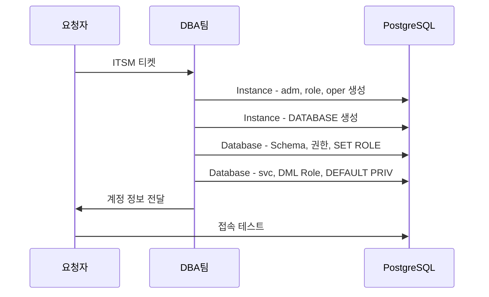

# PostgreSQL DB 계정 생성 런북

| 필드 | 값 |
|-----|-----|
| 도메인 | 인프라 |
| 플랫폼 | `AWS` |
| 서비스 | `RDS`, `PostgreSQL` |
| 유형 | 런북 |
| 대응레벨 | 🔴 에스컬레이션 |
| 트리거유형 | 서비스요청 |
| 상태 | 초안 |
| 소유자 | @윤형도 |
| 최종수정 | 2026-04-10 |
| 문서ID | RB-DB-002 |
| 트리거 | ITSM 서비스 요청 중 "PostgreSQL DB 계정 생성/변경" 요청 |
| 소요시간 | 30분 |
| 난이도 | 보통 |
| 키워드 | `PostgreSQL`, `계정 생성`, `_adm`, `_oper`, `_svc`, `_ops`, `object_owner_role`, `dml_role`, `SET ROLE`, `Owner 분리`, `NOLOGIN`, `DB 계정`, `Aurora`, `RDS`, `DEFAULT PRIVILEGES` |
| 관련문서 | [[DB 계정 분리 규칙]], [[DB 계정 네이밍 규칙]], [[PostgreSQL Owner 관리 규칙]] |

PostgreSQL DB에서 Owner 3단 분리 구조(`_adm` → `object_owner_role` → `dml_role`)에 따라 계정을 생성하는 런북. Instance 레벨(rds_superuser) → Database 레벨 → 서비스 계정 순서로 진행한다. Schema 단위 서비스(기본)와 Database 단위(레거시) 모두 포함. Owner 관리 기준은 [[PostgreSQL Owner 관리 규칙]], 네이밍은 [[DB 계정 네이밍 규칙]] 참조.

## 배경

PostgreSQL은 Schema ≠ User이므로 Oracle과 달리 Owner를 세분화할 수 있다. 이를 활용하여 3단 분리 구조를 적용한다:

```
1단: _adm (LOGIN)              = DATABASE Owner + Schema Owner
2단: object_owner_role (NOLOGIN) = Object Owner (DDL+DML)
3단: dml_role (NOLOGIN)          = DML + 시퀀스 + EXECUTE
```

> 상세 원칙은 [[PostgreSQL Owner 관리 규칙]] 참조.

## 역할 정의

| 역할 | 담당팀 | 책임 범위 |
|-----|-----|-------|
| 요청자 | 서비스팀 | 서비스명, 스키마명, 필요 계정 유형 정의 |
| 처리자 | DBA팀 | 계정/Role/Database/Schema 생성, 권한 부여, SET ROLE 설정 |
| 검증자 | 요청자 | 접속 테스트, DDL/DML 동작 확인 |

## Workflow



## 사전 조건

- [ ] ITSM 티켓 승인 완료
- [ ] 서비스명, 스키마명 확정
- [ ] rds_superuser(fnfadm) 접속 가능
- [ ] 패스워드 정책 준수 확인 — [[DB 계정 분리 규칙]] 참조

## 상세 절차

### Step 1: Instance 레벨 — Role/계정 생성 (rds_superuser에서 실행)

```sql
-- 1. _adm 계정 생성 (LOGIN, DATABASE OWNER + Schema Owner)
CREATE USER [서비스명]_adm WITH PASSWORD '[패스워드]';

-- 2. object_owner_role 생성 (NOLOGIN, Object Owner)
CREATE ROLE [서비스명]_object_owner_role NOLOGIN;
GRANT [서비스명]_object_owner_role TO fnfadm;  -- rds_superuser에 부여 (오브젝트 관리 시 SET ROLE 필요)

-- 3. Database 생성 (_adm이 owner)
CREATE DATABASE [서비스명]_db WITH OWNER [서비스명]_adm ENCODING = 'UTF8';

-- 4. DML Role 생성 (NOLOGIN, 스키마 단위)
CREATE ROLE [스키마명]_dml_role NOLOGIN;

-- 5. 개발자 공유 계정 생성 (기본 1개 발급)
CREATE USER [서비스명]_oper WITH PASSWORD '[패스워드]';
GRANT [서비스명]_object_owner_role TO [서비스명]_oper;
```

### Step 2: Database 레벨 — Schema/권한 설정 (해당 DB 접속 후)

```sql
\c [서비스명]_db

-- 6. CONNECT 권한
GRANT CONNECT ON DATABASE [서비스명]_db TO [서비스명]_oper;

-- 7. Schema 생성 (_adm이 소유, DROP SCHEMA 방지)
CREATE SCHEMA [스키마명] AUTHORIZATION [서비스명]_adm;

-- 8. object_owner_role에 스키마 내 DDL 권한 부여 (스키마 추가 시마다 실행)
GRANT CREATE, USAGE ON SCHEMA [스키마명] TO [서비스명]_object_owner_role;

-- 9. 개발자 SET ROLE 자동 설정 (DDL 시 object owner 통일)
ALTER USER [서비스명]_oper SET role TO [서비스명]_object_owner_role;

-- public schema 오브젝트 생성 차단 (PG15+에서는 기본 적용)
REVOKE CREATE ON SCHEMA public FROM PUBLIC;
```

### Step 3: 서비스 계정 생성 (애플리케이션용, DML 전용)

```sql
CREATE USER [서비스명]_svc WITH PASSWORD '[패스워드]';
GRANT CONNECT ON DATABASE [서비스명]_db TO [서비스명]_svc;

-- DML Role 부여 + SET ROLE 자동 설정
GRANT [스키마명]_dml_role TO [서비스명]_svc;
ALTER USER [서비스명]_svc SET role TO [스키마명]_dml_role;

-- DML Role에 권한 부여
GRANT USAGE ON SCHEMA [스키마명] TO [스키마명]_dml_role;
GRANT SELECT, INSERT, UPDATE, DELETE ON ALL TABLES IN SCHEMA [스키마명] TO [스키마명]_dml_role;
GRANT USAGE, SELECT ON ALL SEQUENCES IN SCHEMA [스키마명] TO [스키마명]_dml_role;
GRANT EXECUTE ON ALL FUNCTIONS IN SCHEMA [스키마명] TO [스키마명]_dml_role;

-- 향후 생성될 객체에 대한 자동 권한 부여
ALTER DEFAULT PRIVILEGES FOR ROLE [서비스명]_object_owner_role IN SCHEMA [스키마명]
  GRANT SELECT, INSERT, UPDATE, DELETE ON TABLES TO [스키마명]_dml_role;
ALTER DEFAULT PRIVILEGES FOR ROLE [서비스명]_object_owner_role IN SCHEMA [스키마명]
  GRANT USAGE, SELECT ON SEQUENCES TO [스키마명]_dml_role;
ALTER DEFAULT PRIVILEGES FOR ROLE [서비스명]_object_owner_role IN SCHEMA [스키마명]
  GRANT EXECUTE ON FUNCTIONS TO [스키마명]_dml_role;

ALTER USER [서비스명]_svc SET search_path TO [스키마명];
```

### Step 4: 시스템 DDL 계정 생성 (도구용, 필요 시)

> DA#, Flyway, Prisma 등 마이그레이션/설계 도구 전용 계정

```sql
CREATE USER [서비스명]_[도구명]_ops WITH PASSWORD '[패스워드]';
GRANT CONNECT ON DATABASE [서비스명]_db TO [서비스명]_[도구명]_ops;
GRANT [서비스명]_object_owner_role TO [서비스명]_[도구명]_ops;
ALTER USER [서비스명]_[도구명]_ops SET role TO [서비스명]_object_owner_role;
```

### Step 5: 서비스 계정 예외 — DDL+DML 필요 시

> 앱이 스키마 마이그레이션(ALTER TABLE 등)을 직접 수행하는 경우

```sql
-- dml_role 대신 object_owner_role 부여
GRANT [서비스명]_object_owner_role TO [서비스명]_svc;
ALTER USER [서비스명]_svc SET role TO [서비스명]_object_owner_role;
```

### Step 6: Database 단위 서비스 (레거시/예외)

> 3rd-party 솔루션 등 스키마가 여러 개로 구성된 경우

```sql
CREATE USER [스키마계정명] WITH PASSWORD '[패스워드]';
GRANT [스키마계정명] TO fnfadm;
CREATE DATABASE [DB명] WITH OWNER [스키마계정명] ENCODING = 'UTF8';

\c [DB명]
REVOKE CREATE ON SCHEMA public FROM PUBLIC;
```

### Step 7: 읽기전용 계정 생성

**PostgreSQL 14 이상 (Database 전체)**:

```sql
CREATE USER [읽기전용계정명] WITH PASSWORD '[패스워드]';
GRANT CONNECT ON DATABASE [DB명] TO [읽기전용계정명];
GRANT pg_read_all_data TO [읽기전용계정명];
```

**PostgreSQL 14 미만 또는 특정 스키마**:

```sql
CREATE USER [읽기전용계정명] WITH PASSWORD '[패스워드]';
GRANT CONNECT ON DATABASE [DB명] TO [읽기전용계정명];
GRANT USAGE ON SCHEMA [스키마명] TO [읽기전용계정명];
GRANT SELECT ON ALL TABLES IN SCHEMA [스키마명] TO [읽기전용계정명];

ALTER DEFAULT PRIVILEGES FOR ROLE [서비스명]_object_owner_role IN SCHEMA [스키마명]
  GRANT SELECT ON TABLES TO [읽기전용계정명];
```

> `pg_read_all_data`는 Database 단위. DB가 2개 이상이면 각 DB에 접속하여 각각 부여 필요.

## 검증 방법

| 확인 항목 | 명령어 | 예상 결과 |
|-------|--------|-------|
| 계정 존재 | `SELECT rolname, rolcanlogin FROM pg_roles WHERE rolname='[계정명]';` | 계정 조회됨 |
| Role 부여 | `SELECT g.rolname FROM pg_auth_members m JOIN pg_roles r ON m.member=r.oid JOIN pg_roles g ON m.roleid=g.oid WHERE r.rolname='[계정명]';` | object_owner_role 또는 dml_role |
| SET ROLE 자동 | `SELECT rolconfig FROM pg_roles WHERE rolname='[계정명]';` | `{role=...}` 확인 |
| DB Owner | `SELECT d.datname, r.rolname FROM pg_database d JOIN pg_roles r ON d.datdba=r.oid WHERE d.datname='[DB명]';` | `_adm` |
| Schema Owner | `SELECT nspname, r.rolname FROM pg_namespace n JOIN pg_roles r ON n.nspowner=r.oid WHERE nspname='[스키마명]';` | `_adm` |
| Owner 점검 | [[DB 계정 정책 점검 런북]] SQL 실행 | MISMATCH 0건 |

## 롤백 절차

| 단계 | 작업 | 상세 |
|-----|-----|-----|
| 1 | 서비스 계정 삭제 | `DROP USER [서비스명]_svc;` |
| 2 | 개발자 계정 삭제 | `DROP USER [서비스명]_oper;` |
| 3 | DML Role 삭제 | `DROP ROLE [스키마명]_dml_role;` |
| 4 | Schema 삭제 | `DROP SCHEMA [스키마명] CASCADE;` (_adm으로 접속) |
| 5 | object_owner_role 삭제 | `DROP ROLE [서비스명]_object_owner_role;` |
| 6 | Database 삭제 | `DROP DATABASE [서비스명]_db;` (rds_superuser) |
| 7 | _adm 삭제 | `DROP USER [서비스명]_adm;` |

> 역순으로 삭제. 의존 관계가 있으므로 순서 준수 필수.

## 트러블슈팅

| 증상/에러 | 원인 | 해결 |
|-------|-----|-----|
| `permission denied for schema` | object_owner_role에 CREATE, USAGE 미부여 | `GRANT CREATE, USAGE ON SCHEMA [스키마명] TO [서비스명]_object_owner_role;` |
| `must be owner of table` | Object Owner 혼재 | Owner를 `object_owner_role`로 변경. [[DB 계정 정책 점검 런북]] 참조 |
| 새 테이블에 _svc가 접근 불가 | DEFAULT PRIVILEGES 미설정 | Step 3의 `ALTER DEFAULT PRIVILEGES` 실행 |
| `role "xxx" cannot be dropped because some objects depend on it` | Role이 오브젝트를 소유 중 | Owner 변경 후 Role 삭제 |
| SET ROLE 안 됨 (RENAME 후) | `ALTER USER SET role TO`가 문자열 기반 | `ALTER USER xxx SET role TO [새이름];` 재설정 — [[PostgreSQL Owner 관리 규칙]] 참조 |

## 에스컬레이션 기준

| 상황 | 대응 | 담당 |
|-----|-----|-----|
| Database 생성 필요 | rds_superuser 권한 필요 | DBA팀 @최종현 |
| Owner 혼재 대량 발견 | 일괄 수정 스크립트 필요 | DBA팀 @최종현 |
| Cross-database 권한 필요 | PostgreSQL은 Cross-database 불가, 아키텍처 검토 | DBA팀 @최종현 |

## 관련 문서

* > 관련: [[PostgreSQL Owner 관리 규칙]] — Owner 3단 분리/Role 체인 기준
* > 관련: [[DB 계정 네이밍 규칙]] — PG 소문자 네이밍, _adm/_oper/_svc/_ops 패턴
* > 관련: [[DB 계정 분리 규칙]] — 계정 유형/권한 기준, 패스워드 정책
* > 관련: [[DB 개발자 계정 운영 런북]] — SET ROLE 사용법, NOINHERIT 안내
* > 관련: [[DB 계정 정책 점검 런북]] — Owner 혼재 점검

---

## 변경 이력

| 버전 | 일자 | 작성자 | 변경내용 |
|-----|-----|-----|------|
| v1.0 | 2026-04-10 | AI(claude-code) | 최초 작성 — 01-dbuser.md에서 PostgreSQL 계정 생성 절차 추출 |
